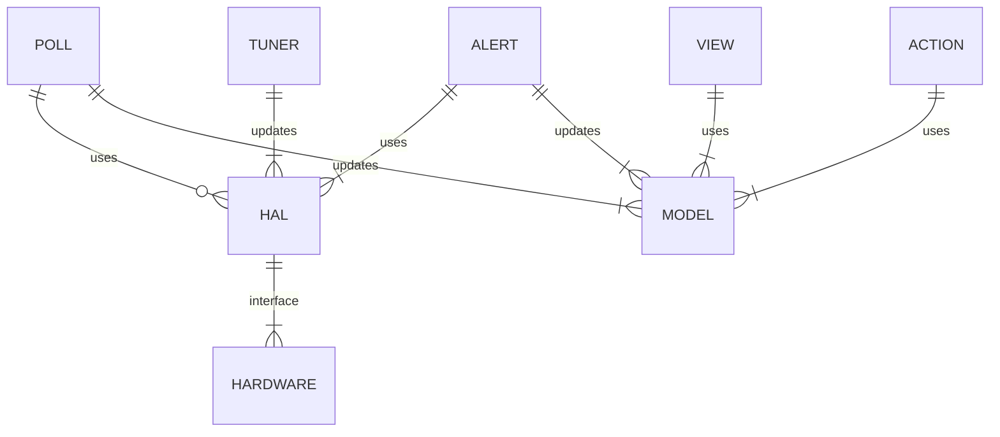

# senErstatz
perl scripts to fake a sensor network for any application , climate control, home automation etc.
this will be the backend for a home automation django webapp for climate control
the interface will be based on POLL and ALERT hardware abstraction the goal is to fully
test the web app before getting hardware.
## Development Set up
Docker engine on windows with a dev container setup and vi with source mounted to the container
this process will work for both perl and django 

## Design
This will start as simple as possible and will just be two csv files one with zone,temp,humidity entries.
used by poll.pl and the other which alert.pl is watching for changes for devices that able to alert.
Both poll and alert will change the model for update to the web app. 
This is fake data for development and testing AKA Synthetic Data

## Next Steps
```
entity diagram done
entity documentation
perl proof of concept cli only
django app perl backend 
```
# entity diagram


